# API

#### decimal.min.js

- URL: https://github.com/MikeMcl/decimal.js/
- Description: The decimal.js library. This is used to perform more accurate floating point operations.
- Implements: `Decimal`

#### HelperMath.js

- Description: This implements basic math functions like complex numbers and complex matrices.
- Source Tree:
  - `Complex(real, imaginary)`
    - Type: `Object`
    - Description: This implements complex numbers and complex number operations.
    - Arguments:
      - `real`
        - Either a JavaScript floating point number or a `Decimal` object. This represents the real component of the complex number.
      - `imaginary`
        - Either a JavaScript floating point number or a `Decimal` object. This represents the imaginary component of the complex number.
    - `Complex.Real`
      - Type: `Property`
      - Description: A `Decimal` object that represents the real component of the complex number.
    - `Complex.Imaginary`
      - Type: `Property`
      - Description: A `Decimal` object that represents the imaginary component of the complex number.
    - `Complex.Sub(comp)`
      - Type: `Method`
      - Description: Subtracts the current `Complex` from the supplied argument `comp`.
        - Arguments:
          - `comp`
            - A `Complex` object to subtract the current `Complex` number from.
      - Returns: A new `Complex` which holds the result of 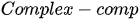.
    - `Complex.Add(comp)`
      - Type: `Method`
      - Description:  Adds the current `Complex` with the argument `comp`.
      - Arguments:
        - `comp`
          - A `Complex` object to add the current `Complex` number with.
      - Returns: A new `Complex` which holds the result of  .
    - `Complex.Mult(comp)`
      - Type: `Method`
      - Description: Multiplies the current `Complex` by the argument  `comp`.
      - Arguments:
        - `comp`
          - A `Complex` object to multiply the current `Complex` number with.
      - Returns: A new `Complex` which holds the result of .
    - `Complex.Inverse()`
      - Type: `Method`
      - Description: Inverts the current `Complex`.
      - Returns: A new `Complex` which holds the result of 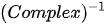.
    - `Complex.Negate()`
      - Type: `Method`
      - Description: Negates the current `Complex`.
      - Returns: A new `Complex` which holds the result of 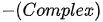.
    - `Complex.Div(comp)`
      - Type: `Method`
      - Description: Multiplies the current `Complex` by the inverse of `comp`.
      - Arguments:
        - `comp`
          - A `Complex` which is inverted and multiplied by the current `Complex`.
      - Returns: A new `Complex` which holds the result of 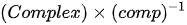.
    - `Complex.Abs()`
      - Type: `Method`
      - Description: Takes the absolute value of the current `Complex`.
      - Returns: A new `Complex` which holds the result of 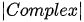.
    - `Complex.toString()`
      - Type: `Method`
      - Description: Creates a string representation of the current `Complex`.
      - Returns: A new `String` which holds a representation of the current `Complex`.
    - `Complex.Sqr()`
      - Type: `Method`
      - Description: Squares the current `Complex`.
      - Returns: A new `Complex` which holds the result of 
    - `Complex.Clone()`
      - Type: `Method`
      - Description: Creates a clone of the current `Complex`.
      - Returns: A new `Complex` which is a clone of the current `Complex`.
  - `Matrix(width, height, opt = true)`
    - Type: `Object`
    - Description: A `Object` that represents a matrix in memory. This `Object` also implements operations on matrices. 
    - Arguments:
      - `width`
        - An `Int` that represents the `width` of the `Matrix`.
      - `height`
        - An `Int` that represents the `height` of the `Matrix`.
      - `opt`
        - A `Boolean` that enables the `Matrix` to be stored differently depending on the `width` and `height`. This speeds up `Matrix` operations and `StateVector` operations.
    - `Matrix.Width`
      - Type: `Property`
      - Description: An `Int` that represents the `width` of the `Matrix`.
    - `Matrix.Height`
      - Type: `Property`
      - Description: An `Int` that represents the `height` of the `Matrix`.
    - `Matrix.Rotated`
      - Type: `Property`
      - Description: A `Boolean` that represents whether the `Matrix` representation has been flipped in memory for optimization reasons.
    - `Matrix.Vals`
      - Type: `Property`
      - Description: A representation of the `Matrix` in memory.
    - `Matrix.Set(i, j, v)`
      - Type: `Method`
      - Description: Sets the value of the matrix at 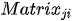. To create a `Matrix` do not use this method.
      - Arguments:
        - `i`
          - An `Int` which represents the width offset in the `Matrix`.
        - `j`
          - An `Int` which represents the height offset in the `Matrix`.
        - `v`
          - A `Complex` which represents the updated value of the `Matrix` at .
    - `Matrix.Get(i, j)`
      - Type: `Method`
      - Description: A method that retrieves the current value of .
      - Arguments:
        - `i`
          - An `Int` which represents the width offset in the `Matrix`.
        - `j`
          - An `Int` which represents the height offset in the `Matrix`.
      - Returns: A `Complex` `Object` which holds the value of .
    - `Matrix.Mult(mat)`
      - Type: `Method`
      - Description:  Multiplies the current `Matrix` by `mat`
      - Arguments:
        - `mat`
          - The `Matrix` to multiply the current `Matrix` with.
      - Returns: A new `Matrix` `Object` which holds the value of .
    - `Matrix.Rotate90()`
      - Type: `Method`
      - Description: Rotates the `Matrix` by 90.
      - Returns: A new `Matrix` `Object` which holds the value of 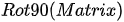.
    - `Matrix.CounterRotate90()`
      - Type: `Method`
      - Description: Rotates the `Matrix` by -90.
      - Returns: A new `Matrix` `Object` which holds the value of 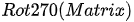.
    - `Matrix.VerticleFlatten()`
      - Type: `Method`
      - Description: Returns an `Array` which holds the first vertical column of the `Matrix`.
      - Returns: A `Array` `Object` which holds the value of 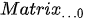.
    - `Matrix.toString()`
      - Type: `Method`
      - Description: Creates a `String` that represents the `Matrix`.
      - Returns: A `String` that represents the `Matrix`.
    - `Matrix.FlatFromArr(arr, horiz = false)`
      - Type: `Method`
      - Description: Creates either a vector or a vector flipped on its side from an `Array` of `Complex` objects.
      - Arguments:
        - `arr`
          - A one dimensional `Array` of `Complex` objects.
        - `horiz`
          - A `Boolean` which if set to `false` creates a vector and if set to `true` creates a vector that is flipped on its side.
      - Returns: A vector or a vector flipped on its side from an `Array` of `Complex` objects. Both in a `Matrix` `Object`.
    - `Matrix.From2dArr(arr2d)`
      - Type: `Method`
      - Description: Creates a new `Matrix` `Object` from a two dimensional `Array` of `Complex` objects. Still implemented for compatibility reasons. Use `Matrix.From2dComplexArr(arr2d)` instead.
      - Arguments:
        - `arr2d`
          - A two dimensional `Array` of `Complex` objects.
      - Returns: A new `Matrix` that is functionally equivalent to the input two dimensional `Array`.
    - `Matrix.From2dRealArr(arr2d)`
      - Type: `Method`
      - Description: Creates a new `Matrix` `Object` from a two dimensional `Array` of JavaScript `Float` objects.
      - Arguments:
        - `arr2d`
          - A two dimensional `Array` of JavaScript `Float` objects.
      - Returns: A new `Matrix` that is filled with `Complex` objects with the `Real` component set to the input `arr2d`.
    - `Matrix.From2dComplexArr(arr2d)`
      - Type: `Method`
      - Description:  Creates a new `Matrix` `Object` from a two dimensional `Array` of `Complex` objects.
      - Arguments:
        - `arr2d`
          - A two dimensional `Array` of `Complex` objects.
      - Returns: A new `Matrix` that is functionally equivalent to the input two dimensional `Array`.
    - `Matrix.Scalar(a)`
      - Type: `Method`
      - Description: Multiplies every element of the matrix by the argument `a`.
      - Arguments:
        - `a`
          - A `Complex` that will be multiplied every element of the `Matrix`.
      - Returns: A new `Matrix` where every element has been multiplied by `a`.

#### Performance.js

- Description: A module that allows the demo to estimate how many qubits the host computer can process in a reasonable amount of time.
- Source Tree:
  - `PerformanceEval()`
    - Type: `Method`
    - Description: provides an estimate of how many qubits a host computer can work with in a reasonable amount of time.

#### qEval.js

- Description: A module that provides an interpreting service to interpret the quantum programming language.
- Source Tree:
  - `qEvaluator`
    - Type: `Object`
    - Description:  A `Object` that provides the quantum language interpreter.
      - `qEvaluator.sim`
        - Type: `Property`
        - Description: An instance of the `QVM` `Object` to actually preform the simulation of the quantum operations.
      - `qEvaluator.measureObj`
        - Type: `Property`
        - Description: An `Array` which represents the measured state vector. If no measurement operation has been performed, this will remain `Undefined`.
      - `qEvaluator.readLine(x)`
        - Type: `Method`
        - Description: A method to feed a line of data into the language interpreter.
        - Arguments:
          - `x`
            - A `String` that represents a line of a quantum program.

#### SimpleQVM.Gates.js

- Description: A module that contains all quantum gate definitions in matrix form. All the gates are contained in the `Object` `qGates`.

#### SimpleQVM.js

- Description: Implements the actual quantum computer simulator.
- Source Tree:
  - `StateVector(nBit)`
    - Type: `Object`
    - Description: A `Object` that stores a quantum state for a quantum computer with `nBit` number of bits.
    - Arguments:
      - `nBit`
        - A JavaScript `Int` that stores the number of bits represented by the state vector.
    - `StateVector.UnitVec`
      - Type: `Property`
      - Description: A `Matrix` that hold the vector that represents the state of the quantum computer.
    - `StateVector.SetBinUnitVector(states)`
      - Type: `Method`
      - Description: Sets qubit indexes to 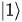.
      - Arguments:
        - `states`
          - An `Array` of qubit indexes to set to .
    - `StateVector.ZeroBinUnitVector()`
      - Type: `Method`
      - Description: Sets all qubits to 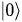.
    - `StateVector.Flatten()`
      - Type: `Method`
      - Description: Creates a one dimensional `Array` of `Complex` objects that represents the `UnitVec`.
      - Returns: A one dimensional `Array` of `Complex` objects that represents the `UnitVec`.
    - `StateVector.GetProbDist()`
      - Type: `Method`
      - Description: Calculates the probabilities of each possible state of the quantum computer.
      - Returns: A new one dimensional `Array` of `Decimal` objects that represents all the possible probabilities of each state.
  - `QVM(nBit)`
    - Type: `Object`
    - Description: A simple `Object` which allows quantum computations.
    - Arguments:
      - `nBit`
        - A JavaScript `Int` that represents the amount of qubits in the simulated quantum computer.
    - `QVM.Gates`
      - Type: `Property`
      - Description: An `Array` of `qGates` objects which represent all the quantum operations in order.
    - `QVM.qBitSels`
      - Type: `Property`
      - Description: An `Array` of `Int` `Array` that represents the qubits to be operated on. The length of `QVM.qBitSels` should match `QVM.Gates`.
    - `QVM.State`
      - Type: `Property`
      - Description: An `StateVector` that represents the current state of the quantum computer simulator.
    - `QVM.Reset()`
      - Type: `Method`
      - Description: Resets `QVM.State` by calling `QVM.State.ZeroBinUnitVector()`.
    - `QVM.Run(trackStates = true)`
      - Type: `Method`
      - Description: Runs the simulation of the quantum computer.
      - Arguments:
        - `trackStates`
          - A `Boolean` that if set to `true` will log every intermediate `StateVector`.
      - Result: An `Array` of intermediate `StateVector`.
    - `QVM.MeasureBits(selBits)`
      - Type: `Method`
      - Description: Calculates the probabilities of each possible state of the quantum computer when measured.
      - Arguments:
        - `selBits`
          - An `Array` of JavaScript `Int` that represents the qubits that are measured.

#### VecGroup.js

- Description: A module that implements algorithms for processing multiple qubits that are entangled.

- Source Tree:

  - `incArr(len)`

    - Type: `Method`
    - Description: Creates an `Array` that counts up from 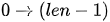.
    - Arguments:
      - `len`
        - A JavaScript `Int` that length.
    - Returns: A new `Array` that counts up from .

  - `baseArrToN(baseArr, base = 2)`

    - Type: `Method`
    - Description: From an `Array` of JavaScript `Int` converts from base `base` to N.
    - Arguments:
      - `baseArr`
        - An `Array` of `Int` which represents the value of the places.
      - `base`
        - A JavaScript `Int` that represents the base of the `baseArr`
    - Returns: A JavaScript `Int` that is the base 10 representation of `baseArr` in the base `base`.

  - `nToBaseArr(n, base = 2)`

    - Type: `Method`
    - Description: Converts a JavaScript `Int` `n` to a base array with the base `base`.
    - Arguments:
      - `n`
        - A JavaScript `Int` to convert into base `base`.
      - `base`
        - The base to use for the conversion.
    - Returns: An `Array` of JavaScript `Int` that represent the number `n` in the base `base`.

  - `padRight0(bitArr, n)`

    - Type: `Method`
    - Description: Appends 0s to `bitArr`.
    - Arguments:
      - `bitArr`
        - The `Array` to append to.
      - `n`
        - A JavaScript `Int` that represents the number of 0s to append to the array.
    - Returns: The original `Array` with `n` extra 0s appended to it.

  - `xorArrs(arr1, arr2)`

    - Type: `Method`
    - Description: Creates a new `Array` that holds every element of `arr1` XORed with `arr2`.
    - Arguments:
      - `arr1`
        - A bit `Array` to be XORed.
      - `arr2
        - A bit `Array` to be XORed.
    - Returns: A new `Array` with every element of `arr1` XORed with `arr2`.

  - `removeFromArray(original, remove) `

    - Type: `Method`
    - Description: Creates a new `Array` that holds every element of `original` that is not in `remove`.
    - Arguments:
      - `original`
        - A generic `Array`.
      - `remove`
        - A generic `Array`.
    - Returns: A new `Array` that holds every element of `original` that is not in `remove`.

  - `orBitSelArray(arr, bitSel) `

    - Type: `Method`
    - Description: ORs all `arr[bitSel]`.
    - Arguments:
      - `arr`
        - A binary `Array` to OR.
      - `bitSel`
        - A JavaScript `Int` `Array` that contains the indexes to OR.
    - Returns: The indexes, `bitSel` of `Array` `arr` ORed.

  -  `orArray(arr)`

    - Type: `Method`
    - Description: ORs all the elements of `arr`
    - Arguments:
      - `arr`
        - A binary `Array` to OR.
    - Returns: All the elements of `arr` ORed.

  - `mapArr(orig, map, preserve = false)`

    - Type: `Method`
    - Description: Returns a new `Array` of `orig[map]`.
    - Arguments:
      - `orig`
        - The `Array` that will be used as the source.
      - `map`
        - A JavaScript `Array` that is an `Array` of indexes to return from `orig`
    - Returns: A new `Array` of `orig[map]`.

  - `generateGroupMap(len, selBits) `

    - Type: `Method`
    - Description: An algorithm that creates a map of quantum states to perform single qubit operations on a pair of two or more entangled qubits.
    - Arguments:
      - `len`
        - A JavaScript `Int` that represents the length of the `StateVector`.
      - `selBits`
        - A JavaScript `Array` of `Int` that represents the index of the qubits that should be operated on.
    - Returns: A map of quantum states to perform single qubit operations on a pair of two or more entangled qubits.

  - `applyGroupMap(map, vec) `

    - Type: `Method`
    - Description: Applies the result of `generateGroupMap(len, selBits) ` to a `StateVector`.
    - Arguments:
      - `map`
        - A group map generated by `generateGroupMap(len, selBits) `
      - `vec`
        - A `StateVector` to apply the group map to.
    - Returns: Groups of pairs of qubit `StateVectors` to be operated on.

  - `removeGroupMap(map, pairs)`

    - Type: `Method`
    - Description: After performing the operation, the pairs must be ‘glued back together’ or combined back into a `StateVector`. Meaning that: `removeGroupMap(map, applyGroupMap(map, vec)) == vec`.
    - Arguments:
      - `map`
        - A group map generated by `generateGroupMap(len, selBits) `.
      - `pairs`
        - An `Array` of pairs generated by `applyGroupMap(map, vec) `.
    - Returns: Reverses the result of `applyGroupMap(map, vec) `.

  - `generateCombinationMap(len, selBits)`

    - Type: `Method`

    - Description: Generates a map to combine probabilities of a `StateVector` to create the illusion of measuring individual qubits. Used for the `M` command (read the Readme).

    - Arguments:

      - `len`
        - A JavaScript `Int` that represents the length of the `StateVector`.

      - `selBits`
        - A JavaScript `Array` of `Int` that represents the index of the qubits that should be operated on.

    - Returns: A map to combine probabilities of a `StateVector`.

  - `ApplyCombinationMap(map, arr, pad = true)`

    - Type: `Method`
    - Description: Applies a map generated by `generateCombinationMap(len, selBits)` to probability vector.
    - Arguments:
      - `map`
        - A group map generated by `generateCombinationMap(len, selBits)`.
      - `arr`
        - A probability vector to apply the group map to.
      - `pad`
        - A `Boolean` that if set to `true` will preserve the original probability vector length.
    - Returns a probability map as if the quantum computer only measured the qubits defined in `generateCombinationMap(len, selBits)` as `selBits`.

- The QVM project contains: `827` lines of JavaScript.